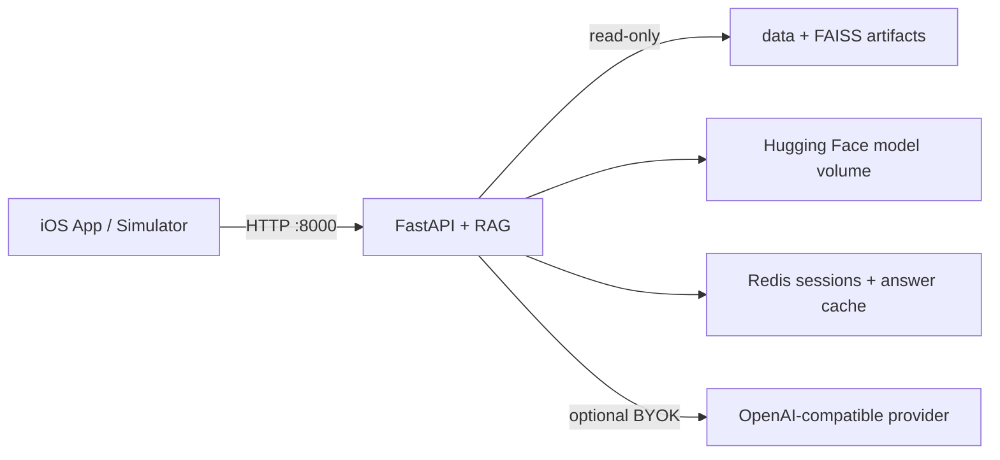

# Docker 开发环境

该工程采用“iOS 原生客户端 + 容器化服务端”的开发形态：

- `client-ios` 必须在 macOS/Xcode 中编译运行，Apple 的 iOS SDK 和模拟器不能在 Linux Docker 容器中运行。
- FastAPI、检索运行时和 Redis 由 Docker Compose 管理。
- `data/` 与 `artifacts/` 是独立知识库制品，以只读目录挂载给 API 容器；更新资料后不必重建应用镜像。
- Hugging Face 模型缓存和 Redis 数据使用 Docker 命名卷，重启容器不会丢失。

## 启动

Docker Desktop 需分配至少 8 GB 内存；首次运行会下载 BGE 模型，耗时取决于网络。

```bash
cp .env.docker.example .env.docker
docker compose -f "back-end engineer/swufe-rag/docker-compose.yml" \
  --env-file .env.docker up --build -d
docker compose -f "back-end engineer/swufe-rag/docker-compose.yml" ps
```

健康检查：

```bash
curl http://127.0.0.1:8000/healthz
curl http://127.0.0.1:8000/readyz
curl http://127.0.0.1:8000/options
```

`healthz` 只检查进程存活；`readyz` 检查知识库、索引清单和 Redis。开发配置关闭 eager warmup，首次访问 `options` 才会加载检索模型。

## iOS 联调

iPhone Simulator 继续使用默认地址 `http://127.0.0.1:8000`。Docker Desktop 会把 Compose 的端口转发到 macOS，因此客户端代码无需切换地址。

真机调试时，在 App 的“设置 -> 关于与数据说明 -> 后端地址”填写 Mac 的局域网地址，例如 `http://192.168.1.5:8000`。如需真机访问，把 `compose.yaml` 中端口绑定的 `127.0.0.1:` 去掉，并确保系统防火墙仅对可信局域网开放。

## 常用命令

```bash
# 查看 API 和 Redis 日志
docker compose -f "back-end engineer/swufe-rag/docker-compose.yml" logs -f app redis

# 重建后端代码镜像
docker compose -f "back-end engineer/swufe-rag/docker-compose.yml" \
  --env-file .env.docker up --build -d app

# 停止服务，保留模型缓存与 Redis 数据
docker compose -f "back-end engineer/swufe-rag/docker-compose.yml" down

# 同时删除命名卷（下次会重新下载模型并清空缓存）
docker compose -f "back-end engineer/swufe-rag/docker-compose.yml" down -v
```

更新 `back-end engineer/swufe-rag/data` 或 `artifacts` 后，重启 API 即可读取新制品：

```bash
docker compose -f "back-end engineer/swufe-rag/docker-compose.yml" restart app
```

## 密钥与运行模式

服务端 API Key 只写入未跟踪的 `.env.docker`。也可以保持 `SWUFE_RAG_LLM_API_KEY` 为空，让 iOS 客户端通过现有 BYOK 设置在每次请求中发送自己的供应商配置。

权威 Compose 位于后端独立仓库，外层不再维护副本。默认启用 Redis，会话和可信答案缓存可跨 API 重启保留。API 容器以 UID `10001` 的非 root 用户运行，知识库挂载为只读。

## 架构


