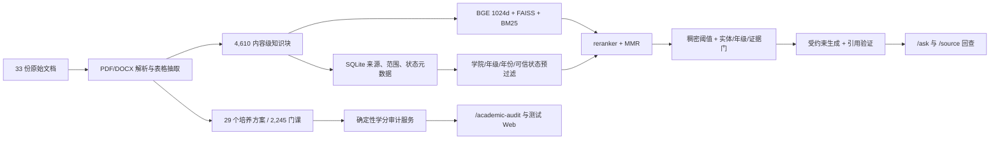

# 西南财大教务 RAG 项目全量审计报告

- 审计日期：2026-07-15
- 仓库：`https://github.com/ZorIgn/swufe-rag.git`
- 分支：`main`
- 需求基线：`西南财大教务RAG问答系统项目计划书.docx`
- 数据基线：新版 `data.zip`、旧版 `swufe-rag-数据模块-交接(1).zip` 与工作区 `data/`

## 1. 结论

当前项目已从原型推进到“本机 CUDA 可完整运行、可测试、可追溯”的 RAG 后端。A 模块不再只是按文件名建索引：现有 33 份原始文档被解析为 37 个来源、4,610 个内容级知识块，其中 2,052 个为表格块；培养方案又被结构化为 29 个“年级—专业/方向”计划和 2,245 条课程记录，能够确定性计算模块要求、已修学分、缺口、必选约束、推荐课程和开课学期。

B 模块已在 RTX 4060 上运行正式 `BAAI/bge-large-zh-v1.5`、FAISS `IndexFlatIP`、BM25 与 `BAAI/bge-reranker-base`。当前 20 题正式检索评估的 Recall@5、证据支持率和复合拒答准确率均为 100%，跨范围污染为 0。生产阈值 `0.35` 在当前正式模型和语料上没有误拒正例；门禁不能只看单一稠密阈值，当前实体、范围和证据门仍需保留。

C 模块的引用绑定、来源回查、证据不足拒答和学校事实/普通对话路由已经串通。无密钥时使用确定性生成器；填写临时 API Key 后按请求创建真实 DeepSeek 客户端，不写入环境或全局运行时。真实普通对话、带引用学校 RAG 和门禁拒答均已完成冒烟测试，但小规模冒烟不能替代批量线上模型验收。

D 按计划暂缓产品化。冻结的 `/ask`、`/options`、`/source/{chunk_id}` 契约未被破坏，并新增独立的学分审计接口和调试 Web。生产部署仍需补认证、限流、监控、容器化、健康检查和真实 LLM 评估。

## 2. 当前架构

普通政策问答与培养方案核算采用两条互补链路：前者适合开放式学校事实检索，后者把学分计算放在结构化规则引擎中，避免让 LLM 自行加减学分或猜课程关系。

## 3. A 模块：数据与知识库

### 已完成

- 覆盖新版数据包的 33 份原始文档；2023 年完整培养方案按学院拆为 5 个逻辑来源，因此来源总数为 37。
- `data/sources.csv` 已统一为 canonical 来源清单，包含标题、层级、学院、年级、年份、状态、官方页面/文件 URL 与采集时间。
- `data/chunks.jsonl` 共有 4,610 个唯一知识块，0 空文本、0 孤儿来源、0 个不可信但可检索的块。
- 切分基于正文条款、段落和表格内容，不以文件名作为知识内容。表格块保留页码/表格位置、课程代码、课程名、学分、性质、学期和开课单位等证据。
- 正式知识库包含 2,052 个表格块，能检索到培养方案具体页面中的模块规则和课程行。
- 培养方案结构化目录覆盖 2017—2024 级，29 个专业/方向计划、2,245 条课程记录；每个计划至少 60 条课程记录。
- 结构化记录可回链到 RAG `chunk_id`、原文摘录和官方 URL，计算结果不是脱离原文的第二套数据。

### 能力边界

- 已能处理“我已修 JavaEE 和算法交易，2024 级计算机科学与技术专业的专业选修还差多少，接下来修什么、哪个学期修”这类问题。
- 用户上传的自报学分不会覆盖培养方案中的官方学分；未知课程不会计入，并返回未匹配警告。
- 专业选修与跨专业选修是两个独立模块，避免把“专业选修至少 8 学分”误答成“跨专业至少 2 学分”。
- 支持 `any_of` 和 `all_of` 约束。例如人工智能专业即使累计学分达到要求，缺少培养方案指定的必选实践课仍会提示补修。

### 后续仍需做

- 为每次语料构建保存不可变 manifest、解析器版本、源文件哈希和人工抽检签字记录，并作为 Release/对象存储交付物保存。
- 对招生、推免名单等范围外或可能含个人信息的材料继续做用途审批和脱敏，不应默认进入公开问答。
- 新增文档时必须重新跑结构化目录一致性检查，不能只增量添加向量而不更新学分规则。

## 4. B 模块：检索与门禁

### 当前实现

- 稠密模型：`BAAI/bge-large-zh-v1.5`，1024 维归一化向量。
- 向量索引：FAISS `IndexFlatIP`。
- 稀疏检索：BM25；融合方式为 RRF，并保留课程代码、数字和条款特征。
- 精排：`BAAI/bge-reranker-base`；结果再执行 MMR 去重。
- 检索前由 SQLite 按可信、启用、状态、学院、年级、年份和主题限定候选范围。
- 门禁由稠密分数、必需实体、年级范围和证据支持共同决定，不允许学校事实在证据不足时回退到通用模型。

### 正式 CUDA 评估

| 指标 | 结果 |
|---|---:|
| 评估问题 | 20 |
| Recall@5 | 100% |
| Evidence support@5 | 100% |
| Scope pollution | 0 |
| 复合拒答准确率 | 100% |
| 仅阈值判断准确率 | 90% |
| 正例最大稠密分数范围 | 0.421273—0.786726 |
| 正例最大稠密分数中位数 | 0.647634 |

生产阈值 `0.35` 低于本次所有正例的最低最大分数 `0.421273`，因此当前没有“门禁太高导致正例误拒”的证据。部分负例也可能获得较高相似度，所以不能仅凭降低阈值解决问题；实体、范围与证据门正是消除误接收的关键。

### 后续仍需做

- 把模型版本、索引 manifest、语料哈希、评估集和指标报告绑定为同一版本化发布物。
- CI 增加可选的 GPU/正式模型验收任务；当前轻量单元测试不能替代模型效果回归。
- 扩大边界问题、历史版本冲突、跨学院同名课程和对抗性问题评估集，再决定是否按主题设置不同阈值。

## 5. C 模块：生成、引用与拒答

### 已完成

- 学校事实在调用生成器前先通过证据门；无证据、实体不匹配或年级不匹配时拒答/澄清。
- 引用必须来自本轮检索块，引用文本必须是可信原文子串；标题与 URL 最终从 SQLite 可信元数据重绑。
- 数字、课程代码和原文支撑经过验证；失败只允许一次受限修复，再失败即拒答。
- 已修复专业选修规则的段落选择问题：当前 `/ask` 返回“专业选修不低于 8 学分”，不会误选同页的跨专业 2 学分规则，也不会把前置课程表噪声带入答案。
- `/source/{chunk_id}` 可回查命中块的完整内容和官方 URL。

### 尚未完成

- 本地 `local-bge-faiss-hybrid` 模式在无密钥时使用确定性生成器；可通过 `X-LLM-API-Key` 为单次请求启用真实 DeepSeek。
- 真实模型冒烟已通过；仍需扩展答案正确率、引用完整率、拒答一致性和提示注入批量评估。
- 对复杂跨条款推理仍应优先发展结构化服务，不应把确定性计算交给生成模型。

## 6. 后端、接口与调试 Web

### 冻结接口

- `GET /options`
- `POST /ask`
- `GET /source/{chunk_id}`

原响应契约保持不变，测试继续覆盖严格 Pydantic 字段和来源回查。

### 新增接口

- `GET /academic-audit/options`：返回年级、专业、模块及目录统计。
- `POST /academic-audit`：按已修课程核算模块要求、缺口、约束、推荐课程/学期与证据。
- `GET /academic-audit-ui`：无需构建工具的调试页面。

2024 级计算机科学与技术专业实测：已修 `CST132`（JavaEE 开发实践）和 `CST410`（算法交易），官方计入 4 学分；专业选修要求 8 学分，还差 4 学分。当前第 5 学期推荐 `CST339` 金融科技基础和 `CST412` 图论及其应用，各 2 学分；返回 5 条可回查证据。

### 生产化缺口

- 认证授权、限流、审计日志、指标监控、链路追踪。
- 健康/就绪探针、容器镜像、部署配置、模型与索引预热。
- 多进程会话状态、TTL 与隐私保留策略。
- 统一异常响应，避免把内部路径或配置细节直接返回客户端。
- D 模块正式产品前端及其用户验收。

## 7. 验证结果

- 全量测试：`135 passed, 2 skipped`，另有 `32 subtests passed`。
- 跳过项是需要外部条件的可选测试；现有失败数为 0。
- Python 语法编译检查通过。
- `git diff --check` 通过，仅提示两个数据文件未来可能发生 LF/CRLF 转换。
- 浏览器实测：29 个培养方案、2,245 条课程可加载；学分结果、推荐课程和 5 条证据正确；控制台 0 个 warning/error。
- 后端运行模式：`local-bge-faiss-hybrid`，知识块数 4,610。
- GPU：NVIDIA GeForce RTX 4060 Laptop GPU，端到端请求后显存占用约 4.7 GB。

## 8. 最终完成度判断

| 模块 | 当前完成度 | 判断 |
|---|---:|---|
| A 数据与知识库 | 90% | 当前数据范围内已可验收；版本化发布与数据治理待补 |
| B 检索与门禁 | 90% | 正式 CUDA 链路与当前评估通过；扩大评估和 CI 待补 |
| C 生成与引用 | 85% | 安全骨架、本地闭环和真实模型冒烟完成；批量线上验收待补 |
| D 产品前端/部署 | 45% | 调试 Web 和接口完成；按计划等待产品化 |

当前适合：课程设计验收、后端联调、本地演示和使用临时密钥的真实模型调试。

当前不应直接宣称：已具备公网生产上线条件，或真实 LLM 的最终答案质量已经通过验收。
