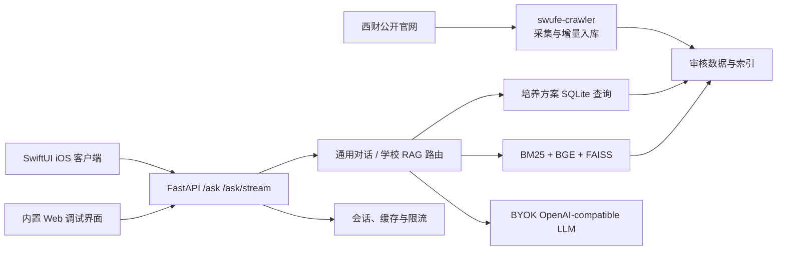

<p align="center">
  
</p>

<h1 align="center">SWUFE RAG Platform</h1>

<p align="center">
  面向西南财经大学教务场景的可信 RAG 问答平台：官网采集、知识库、检索生成、Web API 与 iOS 客户端统一维护。
</p>

<p align="center">
  
  
  
  
</p>

## 项目概览

本项目把学校官网、教务文件与培养方案转成可审核的结构化知识库，并通过混合检索、结构化课程查询和受约束生成提供带来源的回答。当前仓库已经是唯一主仓，后端、客户端和爬虫全部位于 `main`，不再依赖外部嵌套仓库或手工版本指针。

核心能力：

- 可信教务问答：学校事实只从知识库取证，回答提供引用、原文片段和官网链接。
- 混合路由：普通对话走通用 LLM，校内政策与课程问题走可信 RAG/结构化查询。
- 严格范围过滤：按学院、入学年级和专业过滤，避免跨范围引用。
- 完整客户端：原生 SwiftUI iOS App，支持流式回答、历史会话、语音、课表 OCR 与提醒。
- 自动采集：定时抓取学校公开通知，完成切块、向量化、增量合并和回滚备份。
- 可部署后端：FastAPI、Redis、限流、健康检查、Docker Compose 与 Nginx/TLS 配置齐全。

仓库内已登记 70 个来源、69,583 个知识块。生产向量索引、模型缓存和运行时数据库体积较大，按发布数据包管理，不直接提交 Git。

## 系统架构



## 仓库结构

| 路径 | 内容 | 状态 |
|---|---|---|
| [`backend/`](backend/) | RAG、课程审计、FastAPI、Web、测试、Docker 与部署资料 | 当前生产实现 |
| [`client-ios/`](client-ios/) | `SwufeAsk` 原生 SwiftUI 客户端 | 当前客户端 |
| [`swufe-crawler/`](swufe-crawler/) | 官网增量爬虫、切块、向量化与安全合并 | 当前采集流水线 |
| [`docs/`](docs/) | 项目计划与历史交接文档 | 参考资料 |
| [`legacy/prototype-backend/`](legacy/prototype-backend/) | 合并前的早期 mock/接口骨架 | 仅归档，不用于运行 |

详细接口见 [`backend/API_REFERENCE.md`](backend/API_REFERENCE.md)，部署与运维见 [`backend/RUNBOOK.md`](backend/RUNBOOK.md) 和 [`backend/deploy/README.md`](backend/deploy/README.md)。

## 快速开始

### 1. 运行轻量 Demo

轻量 Demo 使用确定性 fixture，不下载向量模型、不调用付费 LLM，适合先验证 API 和页面：

```bash
git clone https://github.com/xiaweiyi713/swufe-rag-platform.git
cd swufe-rag-platform/backend

python3.12 -m venv .venv
source .venv/bin/activate
python -m pip install -r requirements.txt -r requirements-web.txt
python -m app.debug_server
```

浏览器打开 <http://127.0.0.1:8000>。

### 2. 运行后端测试

```bash
cd backend
source .venv/bin/activate
python -m pip install -r requirements-dev.txt -r requirements-web.txt
python -m scripts.rebuild_academic_database_v2
python -m pytest -q
```

### 3. 运行 iOS 客户端

需要 macOS、Xcode 和 XcodeGen：

```bash
brew install xcodegen
cd client-ios
xcodegen generate
open SwufeAsk.xcodeproj
```

模拟器默认连接 `http://127.0.0.1:8000`。真机可在 App 的“关于与数据说明”中填写运行后端的电脑局域网地址。更多说明见 [`client-ios/README.md`](client-ios/README.md)。

## 生产运行

生产模式需要与当前代码版本匹配的运行数据包，其中包含 `metadata.sqlite3`、`academic_v2.sqlite3` 和 `artifacts/`。仅克隆 Git 仓库不足以启动正式 RAG 服务。

准备好数据包后：

```bash
cd backend
python -m scripts.verify_migration_bundle --checksums-only
cp deploy/.env.example .env
docker compose --profile production up -d --build

curl http://127.0.0.1:8000/healthz
curl http://127.0.0.1:8000/readyz
```

生产部署前请完整阅读 [`backend/deploy/README.md`](backend/deploy/README.md)。公网部署必须使用 HTTPS，并将身份认证放在 API 网关或反向代理层。

## 爬虫流水线

爬虫默认把增量合并到同一仓库的 `backend/`，生成内容、状态库与备份均在本地忽略：

```bash
cd swufe-crawler
python3.12 -m venv .venv
source .venv/bin/activate
python -m pip install -r requirements.txt

python crawler.py
python build_chunks.py
```

向量化和正式合并需要使用后端环境及已恢复的生产索引。`merge_into_rag.py` 默认为 dry-run，只有显式传入 `--apply` 才会修改知识库。完整流程见 [`swufe-crawler/README.md`](swufe-crawler/README.md)。

## 数据、密钥与安全

- 不要提交 `.env`、API Key、TLS 私钥、模型缓存、Xcode 构建目录或爬虫运行状态。
- iOS 的 LLM Key 保存在系统 Keychain；后端只按请求使用 BYOK Key，不落盘、不写日志。
- 学校事实无有效证据时必须拒答，不允许回退到通用模型补写校内事实。
- 数据与索引发布必须通过 SHA-256 清单和 `verify_migration_bundle` 校验。
- 爬虫只处理公开页面，保留限速，不抓取登录后内容。

## 开发约定

`main` 是唯一集成基线。新改动从 `main` 创建功能分支，通过测试后再合并；不要重新引入嵌套 Git 仓库或把可再生成的大型运行产物提交进来。

提交信息使用 `feat / fix / docs / refactor / test / chore` 前缀。接口变更需要同步更新 `backend/API_REFERENCE.md`、相关客户端模型和本 README。

## 项目定位

这是课程与工程实践项目，不代表西南财经大学官方服务。知识库内容可能随学校政策更新；正式使用前应核对回答引用的原始文件与官网页面。
