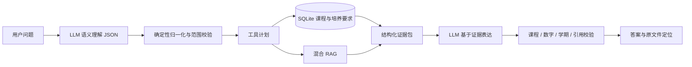

# SWUFE 教务智能问答

[](https://github.com/ZorIgn/swufe-rag/actions/workflows/tests.yml)

面向西南财经大学学生的教务知识问答系统。项目将培养方案课程表、毕业学分要求和校级教务制度统一到一条可验证的查询链路中：适合精确计算的课程事实交给 SQLite，适合解释的制度文本交给 RAG，大语言模型负责理解自然语言和组织答案，程序负责校验数字、课程集合与引用。

系统的目标不是“让模型记住教务信息”，而是让每个学校事实都能回到原文件、原页码和对应证据。

## 能回答什么

- 某年级、某专业、某学期有哪些课程；
- 课程代码、学分、理论/实践学时、课程性质和开课学院；
- 毕业最低学分、模块最低学分、专业准入准出和实践环节要求；
- 培养目标、英语免修、学籍、考试、转专业、推免与保研制度；
- 根据已修课程估算模块完成度，并给出后续修读建议；
- 展示引用文件、物理页码、原页链接和原文件下载链接。

例如：

```text
2023级人工智能专业大三下有哪些选修课？
2024级网络空间安全专业的专业选修模块最低要修多少学分？
离散数学多少学分，在哪个学期开设？
大学英语达到什么条件可以免修？
我已经修完这些课程，还差多少专业选修学分？
```

## 为什么是 SQL + RAG

培养方案同时包含高度结构化的课程表和需要阅读上下文的文字条款。只做向量检索，难以可靠完成“专业 + 年级 + 学期 + 课程性质”的多条件筛选；只做数据库，又无法完整表达培养目标、制度例外和表格脚注。

| 信息类型 | 主要处理方式 | 示例 |
|---|---|---|
| 课程、学分、学期、代码、性质 | 参数化 SQL | “AI 23级第6学期有哪些专业选修课？” |
| 培养目标、制度条款、办事规则 | 混合 RAG | “英语免修有哪些条件？” |
| 学业规划、模块完成度 | SQL + RAG | “已修完这些课，还差多少学分？” |
| 日常非教务对话 | 通用 LLM | 不进入学校事实检索链路 |

## 查询流程



LLM 不直接编写或执行 SQL。后端只接受结构化查询条件，并选择预定义的参数化查询。回答模型只能使用 SQL 结果和 RAG 证据；校验不通过时，系统会使用确定性表达或明确提示证据不足。

## 当前知识库

当前数据快照包含：

- 57 个登记来源；
- 6,699 页原始材料；
- 60,827 个全文知识块与对应向量；
- 468 个结构化培养方案；
- 35,828 行课程记录；
- 5,515 条培养要求。

资料范围包括 2017—2024 级本科培养方案，以及学籍、课程考核、英语免修、转专业、学位授予、推免与保研等教务文件。数据中的“已入全文库”和“已转换为可计算规则”是两个不同层次：课程表优先结构化，文字条款与尚未结构化的脚注仍可通过 RAG 检索并引用。

## 快速开始

### 1. 安装环境

推荐 Python 3.11；持续集成同时验证 Python 3.10 兼容性。

```powershell
git clone https://github.com/ZorIgn/swufe-rag.git
cd swufe-rag
py -3.11 -m venv .venv
.\.venv\Scripts\Activate.ps1
python -m pip install --upgrade pip
python -m pip install -r requirements-dev.txt
```

### 2. 准备本地数据库与索引

Git 仓库保存知识块、来源登记和结构化培养方案目录。SQLite 运行库、FAISS 索引与向量矩阵属于可再生产物，不直接提交到 GitHub：

```powershell
python -m scripts.rebuild_academic_database_v2
python -m retrieval.index --chunks data/chunks.jsonl --artifacts artifacts
```

索引默认使用 `BAAI/bge-large-zh-v1.5`。首次构建需要下载模型；已有迁移数据包时，可以直接放入 `data/` 和 `artifacts/`，无需重新向量化。

### 3. 启动服务

```powershell
python -m app.server
```

打开：

- Web：<http://127.0.0.1:8000/>
- Swagger：<http://127.0.0.1:8000/docs>
- OpenAPI：<http://127.0.0.1:8000/openapi.json>

Web 页面允许按请求填写 DeepSeek API Key。Key 只通过 `X-LLM-API-Key` 请求头发送，不写入项目配置或浏览器持久化存储。

## HTTP API

| 方法 | 路径 | 用途 |
|---|---|---|
| `GET` | `/options` | 获取可用年级、学院、专业和运行状态 |
| `POST` | `/ask` | 自然语言教务问答 |
| `GET` | `/source/{chunk_id}` | 查看引用知识块与原文件定位 |
| `GET` | `/academic-audit/options` | 获取学业审计可选范围 |
| `POST` | `/academic-audit` | 按已修课程计算培养方案完成度 |

最小请求：

```bash
curl -X POST http://127.0.0.1:8000/ask \
  -H "Content-Type: application/json" \
  -H "X-LLM-API-Key: $DEEPSEEK_API_KEY" \
  -d '{
    "question": "2024级网络空间安全专业的专业选修模块最低要修多少学分？",
    "cohort": "2024",
    "major": "网络空间安全专业",
    "session_id": "demo-session"
  }'
```

主要响应字段：

- `answer_md`：通过校验的 Markdown 答案；
- `citations`：文件标题、证据原文、物理页码、原页链接和下载链接；
- `execution_path`：本次使用的 `sql`、`rag`、`sql+rag` 等路径；
- `planner_llm` / `presenter_llm`：LLM 理解与表达阶段状态；
- `validation`：课程、数字、学期和引用校验结果；
- `refused`：证据不足时为 `true`。

完整字段以运行中的 `/docs` 和 [API_REFERENCE.md](API_REFERENCE.md) 为准。

## 测试

```powershell
python -m pytest -q
```

测试覆盖知识块契约、混合检索、路由、课程归一化、参数化执行、回答生成、引用校验、HTTP 接口和学业审计。CI 全程离线运行，不调用真实 LLM，也不下载模型。

如需只验证 Python 语法与兼容性：

```powershell
python -m compileall -q contracts.py retrieval generation app eval swufe_rag academic_audit storage tests
```

## 数据更新

原始资料通过 `data/sources.csv` 登记。重新解析并构建全文知识块：

```powershell
python -m ingest --sources data/sources.csv --raw-dir data/raw `
  --ocr-dir data/ocr --output data/chunks.jsonl --report data/ingest_report.json
```

更新培养方案结构化数据后，依次重建学业数据库和向量索引：

```powershell
python -m scripts.repair_requirement_metadata
python -m scripts.rebuild_academic_database_v2
python -m retrieval.index --chunks data/chunks.jsonl --artifacts artifacts
python -m scripts.audit_requirement_notes
```

新增最低学分、课程约束或表格脚注时，应同时保留原文、`evidence_chunk_id` 和物理页码，不能只写入一个无法追溯的数字。

## 项目结构

```text
academic_audit/   课程表、培养要求、学业完成度与参数化执行
app/              FastAPI 服务、运行时构造和 Web 页面
generation/       证据表达、引用绑定和事实校验
ingest/           PDF/DOCX 解析、表格保留和知识切分
retrieval/        BGE、FAISS、BM25、重排与混合检索
storage/          来源与知识块元数据 SQLite
swufe_rag/        问题理解、归一化、工具规划和总编排
data/             来源登记、知识块与结构化培养方案数据
eval/             检索、路由和答案级评测
tests/            离线测试
```

## 使用边界

- 培养方案描述的是计划安排，不等于当学期实际开课或仍有余量；实际选课以教务系统通知为准。
- 仅凭“以前的课都修完了”可以给出按声明估算的建议，正式学分审计仍需课程清单或成绩单。
- 不同年级和专业的规则不能混用；缺少必要范围时，系统应先澄清。
- 知识库没有可靠证据时不会让通用模型猜测学校规定。

## 进一步阅读

- [API_REFERENCE.md](API_REFERENCE.md)：Python、HTTP、CLI、数据和配置接口
- [BYOK_API.md](BYOK_API.md)：按请求传入模型 Key
- [ACADEMIC_AUDIT_API.md](ACADEMIC_AUDIT_API.md)：学业完成度审计接口
- [INTERFACES.md](INTERFACES.md)：知识块、检索和生成契约

本项目用于教务信息检索与辅助规划。涉及毕业资格、学籍处理、推免资格或当学期选课结果时，请以学校教务系统和相关部门最终审核为准。
