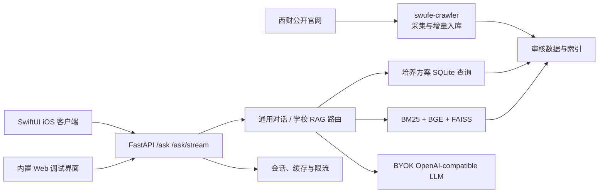

<p align="center">
  
</p>

<h1 align="center">SWUFE RAG Platform</h1>

<p align="center">
  面向西南财经大学教务场景的可信 RAG 问答平台：官网采集、知识库、检索生成、Web API 与 iOS 客户端统一维护。
</p>

<p align="center">
  
  
  
  
  <a href="https://github.com/xiaweiyi713/swufe-rag-platform/actions/workflows/ci.yml"></a>
  <a href="https://huggingface.co/datasets/xiaweiyi/swufe-rag-runtime-data"></a>
  <a href="https://github.com/xiaweiyi713/swufe-rag-platform/releases/tag/data-2026-07-21"></a>
</p>

## 先看这里：代码和数据都在哪里

不需要联系作者索取私有文件，也不需要相信截图。代码、真实小切片、完整运行包和校验值均已公开：

| 内容 | 位置 | 用途 |
|---|---|---|
| 前端、后端、爬虫 | 本仓库 `main` | 唯一集成基线 |
| Tier 0 fixture | [`backend/tests/fixtures/`](backend/tests/fixtures/) | 零下载检查 API 和页面 |
| Tier 1 真实切片 | [`backend/repro/tier1/`](backend/repro/tier1/) | 482 个真实知识块，从文本重建 BGE/FAISS |
| Tier 2 完整运行包 | [Hugging Face Dataset](https://huggingface.co/datasets/xiaweiyi/swufe-rag-runtime-data) | 主下载源，69,583 个知识块 |
| Tier 2 备用下载 | [GitHub Release `data-2026-07-21`](https://github.com/xiaweiyi713/swufe-rag-platform/releases/tag/data-2026-07-21) | 与主源完全相同的归档 |
| 不可变发布记录 | [`backend/repro/releases.json`](backend/repro/releases.json) | 固定 URL、大小、模型 revision 和 SHA-256 |

完整归档大小为 `537,956,303` 字节，SHA-256 为：

```text
b4cb04c3f3e018907f39e405271d676fbdb16d7d4deec86ae195da1ab8c96934
```

> 核心可信链路不需要 LLM Key：混合检索、SQL 学业审计、来源绑定、引用和事实校验都可免费验证。Key 只用于可选的自然语言生成，并采用 BYOK。

## 项目概览

本项目把学校官网、教务文件与培养方案转成可审核的结构化知识库，并通过混合检索、结构化课程查询和受约束生成提供带来源的回答。当前仓库已经是唯一主仓，后端、客户端和爬虫全部位于 `main`，不再依赖外部嵌套仓库或手工版本指针。

核心能力：

- 可信教务问答：学校事实只从知识库取证，回答提供引用、原文片段和官网链接。
- 混合路由：普通对话走通用 LLM，校内政策与课程问题走可信 RAG/结构化查询。
- 严格范围过滤：按学院、入学年级和专业过滤，避免跨范围引用。
- 完整客户端：原生 SwiftUI iOS App，支持流式回答、历史会话、语音、课表 OCR 与提醒。
- 自动采集：定时抓取学校公开通知，完成切块、向量化、增量合并和回滚备份。
- 可部署后端：FastAPI、Redis、限流、健康检查、Docker Compose 与 Nginx/TLS 配置齐全。

仓库内已登记 70 个来源、69,583 个知识块。生产向量索引、模型缓存和运行时数据库体积较大，按发布数据包管理，不直接提交 Git。

## 系统架构



## 仓库结构

| 路径 | 内容 | 状态 |
|---|---|---|
| [`backend/`](backend/) | RAG、课程审计、FastAPI、Web、测试、Docker 与部署资料 | 当前生产实现 |
| [`client-ios/`](client-ios/) | `SwufeAsk` 原生 SwiftUI 客户端 | 当前客户端 |
| [`swufe-crawler/`](swufe-crawler/) | 官网增量爬虫、切块、向量化与安全合并 | 当前采集流水线 |
| [`docs/`](docs/) | 项目计划与历史交接文档 | 参考资料 |
| [`legacy/prototype-backend/`](legacy/prototype-backend/) | 合并前的早期 mock/接口骨架 | 仅归档，不用于运行 |

详细接口见 [`backend/API_REFERENCE.md`](backend/API_REFERENCE.md)，部署与运维见 [`backend/RUNBOOK.md`](backend/RUNBOOK.md) 和 [`backend/deploy/README.md`](backend/deploy/README.md)。

## 从零运行

要求：Git、Python 3.12。只运行 Tier 0/1 不要求 Docker；恢复完整数据并启动服务建议预留至少 10 GB 磁盘和 8 GB 内存。

先完成一次公共安装：

```bash
git clone https://github.com/xiaweiyi713/swufe-rag-platform.git
cd swufe-rag-platform

python3.12 -m venv backend/.venv
source backend/.venv/bin/activate         # macOS / Linux
# Windows PowerShell: .\backend\.venv\Scripts\Activate.ps1
python -m pip install --upgrade pip
python -m pip install -r backend/requirements.txt -r backend/requirements-web.txt
```

安装完成后保持在仓库根目录；下面每个可单独复制的命令块都会先进入正确子目录。

### Tier 0：零下载 fixture Demo

轻量 Demo 使用确定性 fixture，不下载向量模型、不调用付费 LLM，适合先验证 API 和页面：

```bash
cd backend
python -m app.debug_server
```

浏览器打开 <http://127.0.0.1:8000>，健康检查为 <http://127.0.0.1:8000/api/debug/health>。预期看到 `mode: demo` 和 `chunk_count: 24`。

### Tier 1：从真实公开文本重建小型 RAG

仓库直接包含计智学院 2023 级五份真实培养方案的 482 个知识块。下面的命令会按固定的公开模型 revision 重建 FAISS 和来源数据库；不需要 LLM Key，CPU 也可完成：

```bash
cd backend
# 国内网络可在命令前加：export HF_ENDPOINT=https://hf-mirror.com
python -m scripts.reproduce_tier1 build --clean
python -m scripts.reproduce_tier1 verify
python -m scripts.reproduce_tier1 query "计算机科学与技术专业2023级毕业需要多少学分？"
```

成功时 `verify` 会报告 `chunks: 482`，权威命中文档为“计算机科学与技术专业2023级本科人才培养方案”；示例无 Key 查询会从官方 PDF 回答“165 学分”并给出引用。

模型固定为 `BAAI/bge-large-zh-v1.5@79e7739b6ab944e86d6171e44d24c997fc1e0116`，首次构建会自动下载约 1.3 GB 的公开模型，本项目不会重复上传模型权重。切片构成、输入摘要和官方 URL 见 [`backend/repro/tier1/`](backend/repro/tier1/)。

### Tier 2：一条命令恢复完整运行数据

完整的 69,583 个知识块、SQLite 和 FAISS/NumPy 索引发布在 [Hugging Face Dataset](https://huggingface.co/datasets/xiaweiyi/swufe-rag-runtime-data)，并由 [GitHub Release](https://github.com/xiaweiyi713/swufe-rag-platform/releases/tag/data-2026-07-21) 提供备用下载源：

```bash
cd backend
python -m scripts.fetch_runtime_data
python -m scripts.verify_migration_bundle
```

下载器会自动尝试两个发布源，先校验归档 SHA-256，再进行安全解包、逐文件校验、SQLite 完整性检查以及索引维度/行数检查；所有文件先在临时区准备完成，再逐文件原子替换到运行目录。

也可以显式选择下载源：

```bash
python -m scripts.fetch_runtime_data --source huggingface
python -m scripts.fetch_runtime_data --source github
```

完整验证的预期计数：`document_sources=70`、`course_offerings=41017`、`program_requirements=6084`、`policy_chunks=69583`。下载缓存位于 `~/.cache/swufe-rag/`，重复执行会复用已通过 SHA-256 校验的归档。

<details>
<summary>中国大陆下载模型：HF Mirror 与 ModelScope</summary>

HF Mirror 能保持严格 revision，推荐优先使用：

```bash
export HF_ENDPOINT=https://hf-mirror.com
python -m scripts.reproduce_tier1 build --clean
```

也可用 ModelScope 下载后把本地模型目录传给重建脚本：

```bash
python -m pip install modelscope
modelscope download --model AI-ModelScope/bge-large-zh-v1.5 \
  --local_dir "$HOME/.cache/modelscope/bge-large-zh-v1.5"
python -m scripts.reproduce_tier1 build --clean \
  --model-path "$HOME/.cache/modelscope/bge-large-zh-v1.5"
python -m scripts.reproduce_tier1 verify \
  --model-path "$HOME/.cache/modelscope/bge-large-zh-v1.5"
```

</details>

### 运行后端测试

```bash
cd backend
source .venv/bin/activate
python -m pip install -r requirements-dev.txt -r requirements-web.txt
python -m scripts.rebuild_academic_database_v2
python -m pytest -q
```

### 运行 iOS 客户端

需要 macOS、Xcode 和 XcodeGen：

```bash
brew install xcodegen
cd client-ios
xcodegen generate
open SwufeAsk.xcodeproj
```

模拟器默认连接 `http://127.0.0.1:8000`。真机可在 App 的“关于与数据说明”中填写运行后端的电脑局域网地址。更多说明见 [`client-ios/README.md`](client-ios/README.md)。

## 生产运行

生产模式需要与当前代码版本匹配的 `metadata.sqlite3`、`academic_v2.sqlite3` 和 `artifacts/`。Git 不保存这些可再生成的大文件，但仓库提供可校验的一键恢复路径。

本机先下载完整数据和两个公开模型，再启动 App 与 Redis；本地联调不需要配置 TLS：

```bash
cd backend
python -m scripts.fetch_runtime_data

# 首次运行准备公开模型；国内可在命令前设置 HF_ENDPOINT=https://hf-mirror.com
python - <<'PY'
from sentence_transformers import CrossEncoder, SentenceTransformer
SentenceTransformer(
    "BAAI/bge-large-zh-v1.5",
    revision="79e7739b6ab944e86d6171e44d24c997fc1e0116",
)
CrossEncoder("BAAI/bge-reranker-base")
PY

cp deploy/.env.example .env
docker compose up -d --build

curl http://127.0.0.1:8000/healthz
curl http://127.0.0.1:8000/readyz
```

`readyz` 在 BGE、重排模型、FAISS、SQLite 和 Redis 全部就绪后才返回成功。公网生产部署再启用 `--profile production` 和 Nginx/TLS；操作前请完整阅读 [`backend/deploy/README.md`](backend/deploy/README.md)。

## 爬虫流水线

爬虫默认把增量合并到同一仓库的 `backend/`，生成内容、状态库与备份均在本地忽略：

```bash
cd swufe-crawler
python3.12 -m venv .venv
source .venv/bin/activate
python -m pip install -r requirements.txt

python crawler.py
python build_chunks.py
```

向量化和正式合并需要使用后端环境及已恢复的生产索引。`merge_into_rag.py` 默认为 dry-run，只有显式传入 `--apply` 才会修改知识库。完整流程见 [`swufe-crawler/README.md`](swufe-crawler/README.md)。

## 数据、密钥与安全

- 混合检索、SQL 学业审计、来源绑定、引用和事实校验均不需要 LLM Key；Key 只用于可选的自然语言生成，并采用 BYOK。
- 不要提交 `.env`、API Key、TLS 私钥、模型缓存、Xcode 构建目录或爬虫运行状态。
- iOS 的 LLM Key 保存在系统 Keychain；后端只按请求使用 BYOK Key，不落盘、不写日志。
- 学校事实无有效证据时必须拒答，不允许回退到通用模型补写校内事实。
- 数据与索引发布必须通过 SHA-256 清单和 `verify_migration_bundle` 校验。
- 爬虫只处理公开页面，保留限速，不抓取登录后内容。

语料来源和再发布边界见 [`DATA_PROVENANCE.md`](DATA_PROVENANCE.md)。本项目不包含学生成绩、登录后内容、账号、模型权重或个人隐私数据。

## 开发约定

`main` 是唯一集成基线。新改动从 `main` 创建功能分支，通过测试后再合并；不要重新引入嵌套 Git 仓库或把可再生成的大型运行产物提交进来。

提交信息使用 `feat / fix / docs / refactor / test / chore` 前缀。接口变更需要同步更新 `backend/API_REFERENCE.md`、相关客户端模型和本 README。

## 项目定位

这是课程与工程实践项目，不代表西南财经大学官方服务。知识库内容可能随学校政策更新；正式使用前应核对回答引用的原始文件与官网页面。
